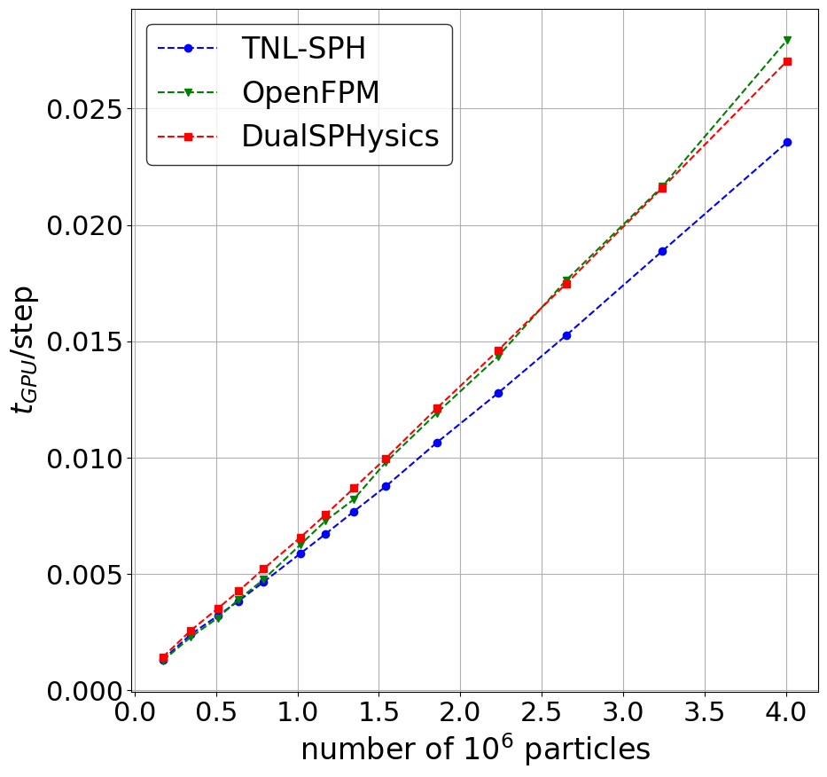

# 🌊 Benchmark of several GPU implementations of SPH method

Benchmarks of several particle codes which provide GPU implementation of Smoothed Particle Hydrodynamics. The comparions includes:

- [TNL-SPH](https://gitlab.com/tnl-project/tnl-sph) solver developed under the [TNL library](https://tnl-project.org/)
- [DualSPHysics](https://dual.sphysics.org/)
- [OpenFPM](http://openfpm.mpi-cbg.de/) library for parallel particle simulations providing SPH examples

Comparison is done using δ-WCSPH scheme considering following examples:

- [3D dam break (SPHERIC test 2)](https://www.spheric-sph.org/tests/test-02) using DBC + Verlet time integration


### Run the benchmarks:

To run prepared benchmarks, `run.sh` script needs to be properly setup in order to provide links on
all tested solvers.

- For TNL-SPH, path `TNL_SPH_PATH` to `tnl-sph` directory needs to be specified
- For DualSPHysics, path `DUALSPHYSICS_PATH` to dualsphysics executables and related libraries needs to be specified
- For OpenFPM, path `OPENFPM_PATH` to OpenFPM installation and related dependencies needs to be specified together with the files `common.mk` and `examples.mk` included by `Makefile`

Solver included in the benchmark are specified as a flags passed to particular benchmark problem:

```bash

#!/bin/bash

# Load TNL-SPH solver: Specify path to TNL-SPH directory
export tnlsphdir=${TNL_SPH_PATH}/tnl-sph

# Load DualSPHysics solver: Add link to the DualSPHysics executable
#export dirbin=/storage/brno2/home/haladto1/DualSPHysics_v5.0.5_meta/bin/linux
export dirbin=${DUALSPHYSICS_PATH}/DualSPHysics_v5.2/bin/linux

export LD_LIBRARY_PATH=${LD_LIBRARY_PATH}:${dirbin}
export gencase="${dirbin}/GenCase_linux64"
export dualsphysicscpu="${dirbin}/DualSPHysics5.2CPU_linux64"
export dualsphysicsgpu="${dirbin}/DualSPHysics5.2_linux64"

# Load OpenFPM solver: Source openfpm variables (source openfpm_vars) and specify path on common.mk and example.mk
export LD_LIBRARY_PATH="$LD_LIBRARY_PATH:${OPENFPM_PATH}/openfpm_installation/openfpm_devices/lib:\
${OPENFPM_PATH}/openfpm_installation/openfpm_vcluster/lib:\
${OPENFPM_PATH}/openfpm_dependencies/METIS/lib:\
${OPENFPM_PATH}/openfpm_dependencies/PARMETIS/lib:\
${OPENFPM_PATH}/openfpm_dependencies/HDF5/lib:\
${OPENFPM_PATH}/openfpm_dependencies/LIBHILBERT/lib:\
${OPENFPM_PATH}/openfpm_dependencies/PETSC/lib:\
${OPENFPM_PATH}/openfpm_dependencies/OPENBLAS/lib"
export PURE_PYTHON=1
export openfpm_example_mk=${OPENFPM_PATH}/openfpm/example/example.mk
export openfpm_common_mk=${OPENFPM_PATH}/openfpm/example/common.mk

# Run benchmark for selected solvers using following flags --tnlsph --dualsphysics --openfpm
cd damBreak3D
./run-benchmark-damBreak3D.sh --tnlsph --dualsphysics --openfpm

```

### Results: 3D dam break (SPHERIC test 2)

[NVIDIA A100 (details)](results/results_dambreak3D-NVIDIA-A100/results.md)            |  [NVIDIA A40 (details)](results/results_dambreak3D-NVIDIA-A40/results.md)
:-------------------------:|:-------------------------:
  |  


[NVIDIA GTX 1080 Ti (details)](results/results_dambreak3D-NVIDIA-GTX-1080-Ti/result.md)            |  [NVIDIA H100 SXM (details)](results/results_dambreak3D-NVIDIA-H100/result.md)
:-------------------------:|:-------------------------:
  |  


[NVIDIA GTX 1080 Ti (details)](results/results_dambreak3D-NVIDIA-GTX-1080-Ti/result.md)            |  [NVIDIA H100 NVL (details)](results/results_dambreak3D-NVIDIA-H100-NVL/result.md)
:-------------------------:|:-------------------------:
  |  

[NVIDIA H100 NVL (details)](results/results_dambreak3D-NVIDIA-H100-NVL/result.md)            |  [NVIDIA L40s (details)](results/results_dambreak3D-NVIDIA-L40s/result.md)
:-------------------------:|:-------------------------:
  |  


[NVIDIA Quadro RTX 5000 (details)](results/results_dambreak3D-NVIDIA-Quadro-RTX-5000/result.md)            |  [NVIDIA RTX A4000 (details)](results/results_dambreak3D-NVIDIA-RTX-A4000/result.md)
:-------------------------:|:-------------------------:
  |  
