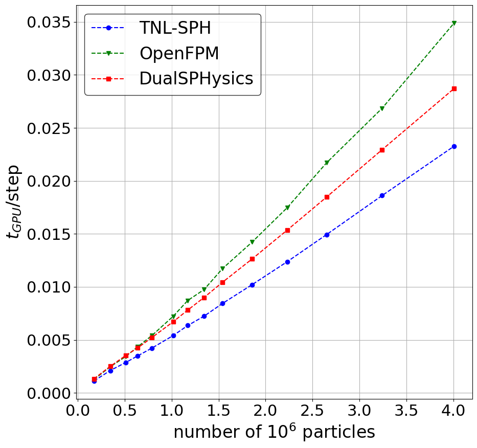

# SPH damBreak3D benchmark

|     |     |
| --- | --- |
| CPU cache sizes (L1d, L1i, L2, L3) (kiB) | 32, 32, 512, 32768 |
| CPU cores | 32  |
| CPU max frequency (MHz) | 3737.890000 |
| CPU model name | AMD EPYC 7543 32-Core Processor |
| CPU threads per core | 1   |
| GPU CUDA cores | 10752 |
| GPU architecture | 8.6 |
| GPU clock rate (MHz) | 1740.000000 |
| GPU global memory (GB) | 47.608693 |
| GPU memory ECC enabled | 1   |
| GPU memory clock rate (MHz) | 7251.000000 |
| GPU name | NVIDIA A40 |
| OpenMP enabled | yes |
| OpenMP threads | 1   |
| architecture | AMD64 |
| compiler | Nvidia NVCC (12.4.99) |
| host name | galdor13.metacentrum.cz |
| start time | Mon Jun 24 2024, 15:06:32 |
| system | Linux |
| system release | 6.1.0-20-amd64 |

- - -

## Case 0.02\_1

|     | interaction: | interaction-average: | search: | search-average: | total: | total-average: |
| --- | --- | --- | --- | --- | --- | --- |
| dualSPHysics | 7.989021 | 0.001041 | 2.120668 | 0.000276 | 10.152071 | 0.001323 |
| OpenFPM | 7.394037 | 0.001149 | \-  | \-  | 8.083360 | 0.001257 |
| TNL::SPH | 6.835989 | 0.000908 | 1.614014 | 0.000214 | 8.450002 | 0.001122 |

- - -

## Case 0.015\_1

|     | interaction: | interaction-average: | search: | search-average: | total: | total-average: |
| --- | --- | --- | --- | --- | --- | --- |
| dualSPHysics | 19.398122 | 0.001862 | 6.541642 | 0.000628 | 26.024216 | 0.002498 |
| OpenFPM | 20.136355 | 0.002318 | \-  | \-  | 21.360700 | 0.002459 |
| TNL::SPH | 16.355890 | 0.001629 | 4.774166 | 0.000476 | 21.130056 | 0.002105 |

- - -

## Case 0.013\_1

|     | interaction: | interaction-average: | search: | search-average: | total: | total-average: |
| --- | --- | --- | --- | --- | --- | --- |
| dualSPHysics | 33.753215 | 0.002700 | 10.153259 | 0.000812 | 44.004314 | 0.003520 |
| OpenFPM | 32.905050 | 0.003265 | \-  | \-  | 34.475000 | 0.003421 |
| TNL::SPH | 27.190327 | 0.002348 | 5.924922 | 0.000512 | 33.115250 | 0.002859 |

- - -

## Case 0.012\_1

|     | interaction: | interaction-average: | search: | search-average: | total: | total-average: |
| --- | --- | --- | --- | --- | --- | --- |
| dualSPHysics | 46.440104 | 0.003366 | 11.912293 | 0.000863 | 58.469482 | 0.004238 |
| OpenFPM | 46.176230 | 0.004157 | \-  | \-  | 48.255200 | 0.004344 |
| TNL::SPH | 36.665543 | 0.002922 | 7.075357 | 0.000564 | 43.740898 | 0.003486 |

- - -

## Case 0.011\_1

|     | interaction: | interaction-average: | search: | search-average: | total: | total-average: |
| --- | --- | --- | --- | --- | --- | --- |
| dualSPHysics | 63.604752 | 0.004231 | 14.846466 | 0.000988 | 78.572678 | 0.005227 |
| OpenFPM | 63.250570 | 0.005218 | \-  | \-  | 65.664000 | 0.005417 |
| TNL::SPH | 49.610159 | 0.003625 | 8.277268 | 0.000605 | 57.887428 | 0.004229 |

- - -

## Case 0.01\_1

|     | interaction: | interaction-average: | search: | search-average: | total: | total-average: |
| --- | --- | --- | --- | --- | --- | --- |
| dualSPHysics | 91.473016 | 0.005497 | 19.917565 | 0.001197 | 111.549927 | 0.006704 |
| OpenFPM | 94.565860 | 0.006989 | \-  | \-  | 97.694300 | 0.007220 |
| TNL::SPH | 71.153547 | 0.004725 | 10.196126 | 0.000677 | 81.349678 | 0.005402 |

- - -

## Case 0.0095\_1

|     | interaction: | interaction-average: | search: | search-average: | total: | total-average: |
| --- | --- | --- | --- | --- | --- | --- |
| dualSPHysics | 112.624569 | 0.006414 | 24.341144 | 0.001386 | 137.159073 | 0.007811 |
| OpenFPM | 120.498160 | 0.008386 | \-  | \-  | 125.205000 | 0.008714 |
| TNL::SPH | 88.022801 | 0.005552 | 12.71315 | 0.000802 | 100.735954 | 0.006354 |

- - -

## Case 0.009\_1

|     | interaction: | interaction-average: | search: | search-average: | total: | total-average: |
| --- | --- | --- | --- | --- | --- | --- |
| dualSPHysics | 140.145207 | 0.007508 | 27.619418 | 0.00148 | 167.961136 | 0.008999 |
| OpenFPM | 142.512500 | 0.009478 | \-  | \-  | 146.524000 | 0.009745 |
| TNL::SPH | 107.645200 | 0.006435 | 13.378952 | 0.0008 | 121.024155 | 0.007234 |

- - -

## Case 0.0085\_1

|     | interaction: | interaction-average: | search: | search-average: | total: | total-average: |
| --- | --- | --- | --- | --- | --- | --- |
| dualSPHysics | 170.359140 | 0.008655 | 34.818004 | 0.001769 | 205.407700 | 0.010436 |
| OpenFPM | 184.267060 | 0.011434 | \-  | \-  | 188.967000 | 0.011725 |
| TNL::SPH | 132.053201 | 0.007454 | 17.421164 | 0.000983 | 149.474365 | 0.008437 |

- - -

## Case 0.008\_1

|     | interaction: | interaction-average: | search: | search-average: | total: | total-average: |
| --- | --- | --- | --- | --- | --- | --- |
| dualSPHysics | 226.087982 | 0.010678 | 40.940086 | 0.001934 | 267.279938 | 0.012624 |
| OpenFPM | 238.448210 | 0.013805 | \-  | \-  | 245.532000 | 0.014216 |
| TNL::SPH | 174.492579 | 0.009268 | 17.559805 | 0.000933 | 192.052383 | 0.010201 |

- - -

## Case 0.0075\_1

|     | interaction: | interaction-average: | search: | search-average: | total: | total-average: |
| --- | --- | --- | --- | --- | --- | --- |
| dualSPHysics | 296.431216 | 0.013037 | 52.300565 | 0.0023 | 349.041199 | 0.015351 |
| OpenFPM | 314.860060 | 0.017076 | \-  | \-  | 321.993000 | 0.017463 |
| TNL::SPH | 226.517088 | 0.011284 | 21.761894 | 0.001084 | 248.278992 | 0.012368 |

- - -

## Case 0.007\_1

|     | interaction: | interaction-average: | search: | search-average: | total: | total-average: |
| --- | --- | --- | --- | --- | --- | --- |
| dualSPHysics | 383.642727 | 0.015769 | 65.542464 | 0.002694 | 449.532593 | 0.018477 |
| OpenFPM | 419.128400 | 0.021097 | \-  | \-  | 431.289000 | 0.021709 |
| TNL::SPH | 294.067851 | 0.013671 | 27.243064 | 0.001267 | 321.310913 | 0.014938 |

- - -

## Case 0.0065\_1

|     | interaction: | interaction-average: | search: | search-average: | total: | total-average: |
| --- | --- | --- | --- | --- | --- | --- |
| dualSPHysics | 519.438555 | 0.019646 | 86.555925 | 0.003274 | 606.416565 | 0.022936 |
| OpenFPM | 566.054300 | 0.026320 | \-  | \-  | 577.265000 | 0.026841 |
| TNL::SPH | 396.300017 | 0.017106 | 34.798597 | 0.001502 | 431.098602 | 0.018608 |

- - -

## Case 0.006\_1

|     | interaction: | interaction-average: | search: | search-average: | total: | total-average: |
| --- | --- | --- | --- | --- | --- | --- |
| dualSPHysics | 754.436815 | 0.024742 | 120.50137 | 0.003952 | 875.48700 | 0.028712 |
| OpenFPM | 792.518000 | 0.033894 | \-  | \-  | 815.80200 | 0.034890 |
| TNL::SPH | 540.239811 | 0.021535 | 43.602175 | 0.001738 | 583.84198 | 0.023273 |

- - -

